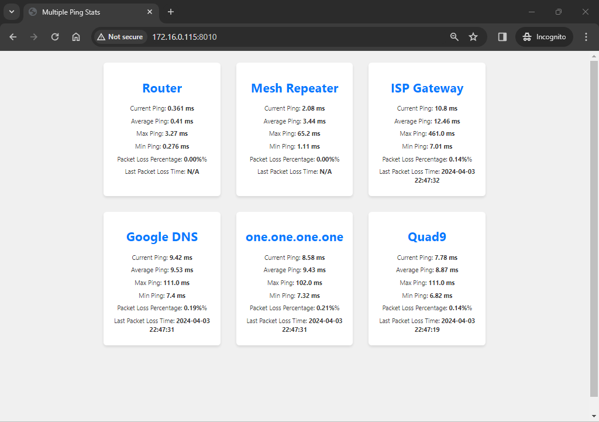

# Ping Monitor

## Welcome & Thank You

Welcome to the repository for my Ping Monitor project. This tool is designed to monitor the status of multiple IP addresses by pinging them simultaneously. It's a project that I've put together rather quickly and then adjusted to add more functionality.

### Compatibility

The Ping Monitor should install automatically on any Debian-based Linux system. It has been tested on:

- Ubuntu 22.04
- Ubuntu 18.04

For other systems, you will need to ensure that the following dependencies are installed:

- lighttpd
- Python
- Flask
- SQLite



### Installation

The setup is intended to work out-of-the-box on my specific system configuration, and might require some adjustments to work on yours. The included `setup.sh` script facilitates the installation and setup process by setting up everything needed to run the Ping Monitor as a service.

To install, follow these steps:

```bash
chmod +x setup.sh
./setup.sh
```

This will install all the necessary packages and start the service on port 8010. You can access the service via `http://localhost:8010` or `http://yourserverip:8010`.

### Configuration

#### Setting Up Ping Targets

Before configuring the ping targets, stop the service:

```bash
systemctl stop multiping.service
```

Navigate to the `multiping` directory created by `setup.sh`. It should be in the same directory as your `setup.sh` script.

1. **Edit Network Interface**: Open `app.py` in your preferred editor (e.g., nano, Notepad++, or Visual Studio Code). Find the `PingMonitor` class and locate the line:

    ```python
    def __init__(self, ip_addresses, interface="br0", interval=1):
    ```

    Replace `"br0"` in `interface="br0"` with your actual network interface (e.g., `enp1s0`, `wl0`, etc.).

2. **Configure IP Addresses**: Locate the section where IP addresses are defined:

    ```python
    ip_addresses = [{'ip': ip, 'name': ip} for ip in ['1.1.1.1', '2.2.2.2', ...]]
    for ip_address in ['1.1.1.1', '2.2.2.2', ...]:
    ```

    Replace the example IP addresses with the ones you wish to monitor. Ensure the format follows the pattern `'ipaddr1', 'ipaddr2', ...`.

    Make sure both sections are updated and match in terms of the IP addresses listed.

3. **Change Service Port**: If needed, change the port on which the service runs by editing the line at the bottom of `app.py`:

    ```python
    app.run(host='0.0.0.0', port=8010)
    ```

    Replace `8010` with your desired port number.

Restart the service with:

```bash
systemctl start multiping.service
```

Access the Ping Monitor via `http://localhost:specifiedport` or `http://yourserverip:specifiedport`.

#### Customizing Container Names

Initially, each container will be named after the IP address it is monitoring. You can change this name by clicking on the address and entering a new name. This updates the database and retains the change in memory.

### Enjoy

Your Ping Monitor is now set up and ready to use. Enjoy monitoring your IP addresses with ease!
